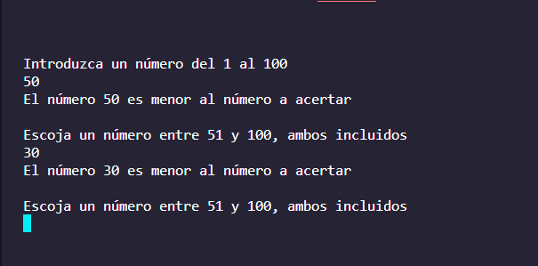
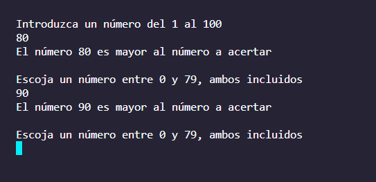
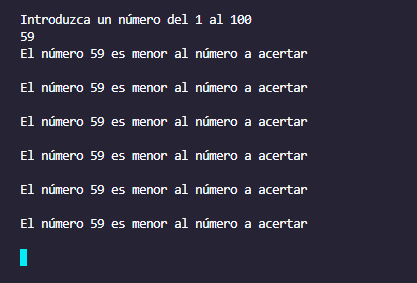
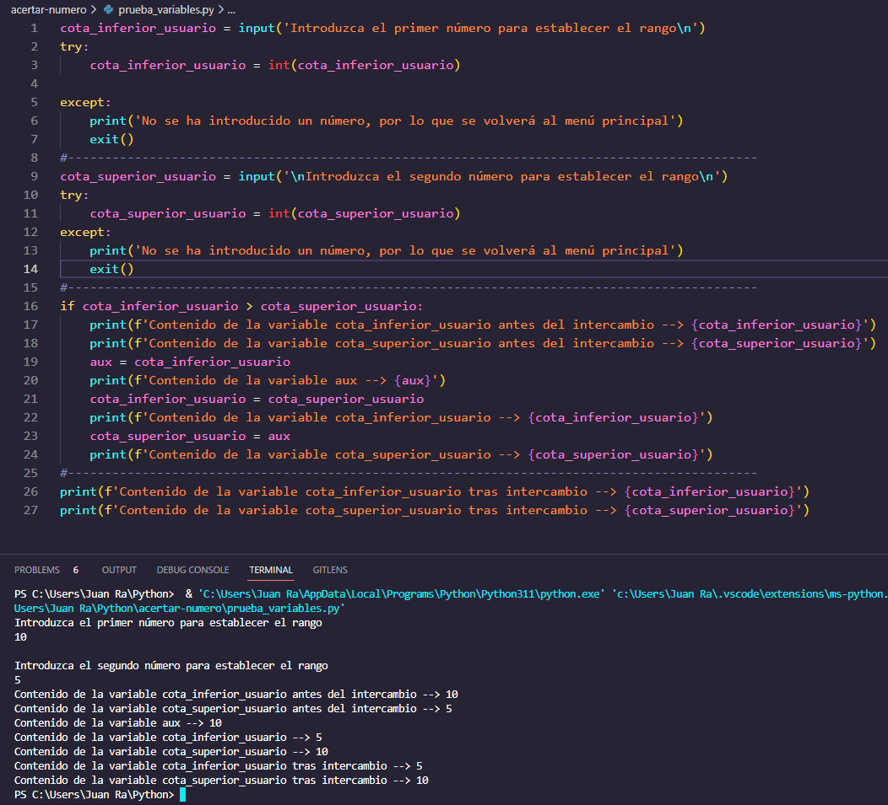

# acertar-numero

Este código es principalmente para realizar el juego de acertar el número, he tratado de realizar la máxima agregación de opciones al código para que sea versátil, hay un modo por defecto que únicamente es para acertar un número aleatorio empezando desde el 0 hasta el 100, también hay otra opción que es acertar un número aleatorio según los valores que se piden al usuario.

No hay que esperar mucho sobre este repo ya que estoy aprendiendo este lenguaje de programación :books:

He tratado de separar el código en distintos archivos para no tener tanto código en el mismo archivo y tener algunas estructuras repetidas o similares, de forma que hay un archivo principal, **main.py**, y un directorio, **personal_modules**, que contiene el resto de archivos y se importan al archivo principal.

**Me gustaría que si hay alguna modificación o agregación al código, me la pusierais, *¡gracias!*** :smile:

## personal_modules

Como es un juego algo "sencillo" en cuanto a mecánicas, he tratado de añadir todo lo posible que se me ha ocurrido, **empezaré explicando los archivos que he creado en el directorio personal_modules**.

**Python permite crear archivos con distintas funcionalidades e importarlos dentro de otro archivo como si fuesen módulos creados por defecto junto a la instalación del lenguaje de programación**, por lo que usaré esta forma para crear varios archivos e importarlos para usarlos y evitar tener en un único archivo todo el código que hay que usar para este juego.

**Hay que tener especial cuidado en el formateo del código ya que no se sigue un sistema que indica el inicio y el final de una Estructura o Statement, ya que se hace mediante tabulaciones**. :astonished:

### clear_screen.py

Este archivo sirve para realizar una limpieza de pantalla cada ciertas líneas de código para que sea lo más legible y no provoque líos innecesarios.

```python
import platform

import os
```

Mediante *IMPORT* he importado dos módulos, **platform para conocer el tipo de sistema operativo dónde se ejecuta el código** y **os para ejecutar los comandos correspondientes en cada sistema operativo**.

```python
def funcion_principal():
    os_system = platform.system()

    if (os_system != 'Linux') and (os_system != 'Windows'):
        print('No es ni Linux ni Windows, por lo que se detendrá la ejecución del programa')
        exit()
```

He creado una función principal para este módulo o biblioteca y posteriormente llamar a la función en el archivo principal del repo, **dentro de la función tenemos una variable**, **os_system**, que **haciendo uso del módulo platform y una función que contiene el módulo system() nos permite almacenar en la variable el tipo de sistema operativo dónde se está ejecutando**.

A continuación **usaremos el IF Statement para realizar ciertas acciones**. En el caso de que en la variable se guarde un valor distinto a Linux o Windows, el programa se detendrá.

```python
    elif os_system == "Linux":
        os.system('clear')
```

De forma seguida, **con ELIF podemos establecer condiciones**, en el caso de que el sistema operativo sea un Linux, **haciendo uso del módulo os y su función system() podemos usar comandos como si estuviésemos en una línea de comandos**, en este caso se hace uso del comando "clear" para limpiar la pantalla.

```python
    elif os_system == "Windows":
        os.system('cls')
```

En el caso de que sea un sistema operativo Windows, usaremos el comando "cls" para limpiar la pantalla.

### show_menu_options.py

Con este archivo definiremos una función principal, al igual que hicimos con el archivo anterior, y únicamente nos servirá para mostrar un menú con las opciones que tiene el código.

```python
def funcion_principal():
    print("1.- Para jugar desde el rango del 1 al 100\n")
    print("2.- Para establecer rangos personalizados y jugar\n")
    print("3.- Finalizar la ejecución del código\n")
```

### default_random.py

Este archivo será el que generará un número aleatorio entre el 0 y el 100, para ello, **hay que importar el módulo *random* y también el módulo *time* para realizar unas pequeñas pausas** en ciertas partes concretas del código.

```python
def funcion_principal():
    contador_intentos = 1

    aleatorio_generado = random.randint(0, 100)

    cota_inferior = 0

    cota_superior = 100
```

Empezaré definiendo e inicializando cuatro variables, la primera, **contador_intentos sirve para establecer el número de intentos**, **por defecto se inicializa a 1 debido a una petición de número al usuario fuera del bucle** que hay a continuación de las variables.

**En la variable aleatorio_generado se guarda un número aleatorio usando el módulo random y la función randint()**, indicando el rango de números que pueden ser aleatorios.

**Las variables cota_inferior y cota_superior servirán para delimitar al usuario el rango de números entre los que se encuentra el número que hay que adivinar**. Por defecto se inicializan a los números extremos del rango para que funcione correctamente el código cuando se realice la implementación de la actualización de ambas variables.

```python
    numero = input('Introduzca un número del 1 al 100\n')

    try:
        numero = int(numero)

    except:
        print('No se ha introducido un número, por lo que se volverá al menú principal')
        time.sleep(4)
        return
```

Esta parte del código, se pedirá un número al usuario que se guardará en la variable "numero", después, **tenemos que tratar de convertir el contenido de la variable introducida por el usuario de STR (string o cadena) a INT (integer o entero) mediante TRY**, **y en caso de no poder hacerlo**, **entrará a EXCEPT que mostrará un mensaje**, **hará una parada de 4 segundos y con RETURN volverá al archivo principal**, ***main.py***.

```python
    while numero != aleatorio_generado:
        contador_intentos = contador_intentos + 1

        if numero < aleatorio_generado:
            print('El número', numero, 'es menor al número a acertar\n')

            time.sleep(1)

            if numero >= cota_inferior:
                cota_inferior = numero + 1
```

Con la siguiente estructura del código hacemos que mientras el número del usuario sea distinto del número aleatorio entre en el bucle WHILE e incremente la variable contador_intentos en una unidad, después comprueba si el número introducido por el usuario es menor que el número aleatorio y en el caso de serlo, muestra un mensaje indicando tal caso, haciendo una parada del código de un segundo y **si el número es mayor que el contenido de la variable cota_inferior actualizará el contenido de la variable al número más una unidad para indicar en todo momento el rango inferior entre el que se encuentra el número aleatorio, incluso en el caso de que el usuario se equivoque**.



```python
        elif numero > aleatorio_generado:
            print('El número', numero, 'es mayor al número a acertar\n')
            
            # Parada de dos segundos para que el usuario lea la última línea generada
            time.sleep(1)

            # Actualización de la cota superior para indicar en todo momento la última actualización del número
            if numero <= cota_superior:
                cota_superior = numero - 1
```

A continuación, hay que comprobar el caso contrario, que el número introducido por el usuario sea mayor que el número aleatorio, en este caso, mostrará un mensaje de tal afirmación, hará una parada de un segundo y **en el caso de que el número del usuario sea menor que el contenido de la variable cota_superior**, **actualizará el contenido de la variable al número menos una unidad para indicar el rango superior entre el que se encuentra el número aleatorio**, incluso en el caso de que el usuario introduzca un número superior al actual de la variable.



```python
numero = input(f'Escoja un número entre {cota_inferior} y {cota_superior}, ambos incluidos\n')

        try:
            numero = int(numero)

        except:
            print('No se ha introducido un número, por lo que se volverá al menú principal')
            time.sleep(4)
            return

    if numero == aleatorio_generado:
        time.sleep(1)

        print('\n¡Has acertado el número aleatorio!')

        print(f'Te ha costado {contador_intentos} vez/veces\n')

        input('Pulse la tecla Intro o Enter para continuar...\n')
```

Para ir finalizando con este archivo, **hay que pedir al usuario un número ya que en caso de no hacerlo se provocaría un bucle infinito en el que el programa estaría mostrando el último mensaje constantemente**. En esta petición de número, hay que mostrar el rango en el que se encuentra el número aleatorio, por lo que **habrá que usar la cadena F o f-String que permite usar variables dentro de un PRINT sin necesidad de concatenar el texto con las variables**.



Después, habrá que convertir el tipo de dato de la variable como se hizo antes de entrar al bucle WHILE si es posible y en caso contrario volver al menú principal, **solo que esta vez hay que hacerlo dentro del bucle**, y por último, comprobará si el número introducido por el usuario es igual al número aleatorio, en el caso de serlo, mostrará el mensaje de que ha acertado, los intentos que le ha costado al usuario y que para continuar con la ejecución normal del programa pulse una tecla, ***preferiblemente la tecla Intro***.

### custom_random.py

Con este archivo se pedirá al usuario un rango de números entre los que estará el número aleatorio que se generará mediante el módulo random y su función randint(). Como tiene partes de código iguales al anterior archivo, mostraré las partes de código que varían.

```python
    cota_inferior_usuario = input('Introduzca el primer número para establecer el rango\n')

    try:
        cota_inferior_usuario = int(cota_inferior_usuario)

    except:
        print('No se ha introducido un número, por lo que se volverá al menú principal')
        time.sleep(4)
        return
```

Se pedirá al usuario un número para empezar a establecer el rango, después se comprobará que el contenido de la variable sea numérica para poder continuar.

```python
    cota_superior_usuario = input('\nIntroduzca el segundo número para establecer el rango\n')

    try:
        cota_superior_usuario = int(cota_superior_usuario)

    except:
        print('No se ha introducido un número, por lo que se volverá al menú principal')
        time.sleep(4)
        return
```

A continuación se pedirá al usuario el segundo número para finalizar el rango de números entre los que estará comprendido el número aleatorio, también se realizará una comprobación para poder continuar.

```python
    if cota_inferior_usuario > cota_superior_usuario:
        aux = cota_inferior_usuario
        cota_inferior_usuario = cota_superior_usuario
        cota_superior_usuario = aux
```

Como no hay certeza de que el usuario introduzca los números en orden, **siendo la primera petición de número el menor y siendo la segunda y última petición de número el mayor**, **habrá que provocar que se compruebe cuál de los dos es el menor y el mayor y realizar un intercambio del contenido de las variables en el caso de que sea necesario**. Para ello **hay que usar el IF Statement con la condición de que el primer número sea mayor que el segundo**, **en el caso de que se de la condición** del IF, entrará y **realizará el cambio del contenido de las variables haciendo uso de una tercera variable llamada auxiliar**.



```python
    aleatorio_personalizado = random.randint(cota_inferior_usuario, cota_superior_usuario)

    cota_inferior = cota_inferior_usuario

    cota_superior = cota_superior_usuario
```

Según lo que haya introducido el usuario en ambas peticiones de números, independientemente de si lo ha hecho por orden o se ha ordenado usando el intercambio de variables, se escogerá un número en dicho rango numérico determinado por el usuario y **se hará uso de las variables que han guardado dicha introducción de contenido para generar un número aleatorio en la variable aleatorio_personalizado usando el módulo random y su función randint()**, por último, **hay que establecer en las variables cota_inferior y cota_superior el contenido respectivo de las variables introducidas por el usuario para indicar el rango en el que se encuentra el número aleatorio**.

El resto del código del archivo es igual o similar al del anterior archivo, por lo que no es necesario hacer una explicación del mismo.

## main.py

**Este es el archivo principal que importará el resto de módulos** (**archivos en formato .py**) que se han creado **para posteriormente llamarlos junto a su función principal**.

```python
import personal_modules.clear_screen

import personal_modules.show_menu_options

import personal_modules.default_random

import personal_modules.custom_random
```

**Hay que importar los archivos creados anteriormente**, como los tengo en un directorio que se llama personal_modules, **hay que hacer referencia al directorio en el que se encuentran seguido del símbolo dot o punto y el nombre del archivo sin su extensión**.

Hay otra forma de realizar esta importación, creando el archivo **\_\_init__.py** y creando una variable dentro del archivo haciendo referencia al directorio en el que se encuentran y sus nombres, como son únicamente cuatro archivos, no es necesario realizar la otra forma, en el caso de que fuesen bastantes más, es recomendable realizar la importación de la otra forma para evitar tener mucho código en el archivo.

Dejo la otra forma de importar las variables --> [Importing * From a Package](https://docs.python.org/3/tutorial/modules.html#importing-from-a-package)

```python
def main():
    
    user_option = 0

    while user_option != 3:
    
        personal_modules.clear_screen.funcion_principal()

        personal_modules.show_menu_options.funcion_principal()

        user_option = int(input('Introduzca la opción deseada\n'))
```

En este archivo **crearé una función que será la que llame a los demás archivos o módulos creados** y recoger las opciones que introduzca el usuario. **Dentro de la función "main"**, **hay que inicializar la variable de entrada al bucle**, **dentro del bucle se llamará al archivo clear_screen.py para que limpie la pantalla** y que únicamente muestre lo que quiero, por lo que **hay que hacer referencia usando su ruta, el nombre del archivo y la función que contiene el archivo**. **Hay que hacer lo mismo con el archivo show_menu_options.py**, de forma que únicamente se verá el menú creado tras la limpieza de pantalla. A continuación, hay que pedir al usuario que escoja una de las opciones dadas por el menú y se guardará la opción escogida en la variable user_option.

```python
        if user_option == 1:
            personal_modules.clear_screen.funcion_principal()

            personal_modules.default_random.funcion_principal()
```

En el caso de que el usuario introduzca el número uno para usar adivinar un número aleatorio del 0 al 100, se ejecutará el módulo para limpiar la pantalla e inmediatamente después el módulo default_random y su función.

```python
        elif user_option == 2:
            personal_modules.clear_screen.funcion_principal()

            personal_modules.custom_random.funcion_principal()
```

En el caso de que el usuario introduzca el número dos para adivinar un número aleatorio con un rango indicado por el propio usuario, de nuevo se llamará al módulo para limpiar la pantalla y después ejecutará el módulo custom_random y su función.

```python
        elif user_option == 3:
            print('Ejecución detenida')
```

Por último, en el caso de que el usuario quiera finalizar la ejecución del código e introduzca el número tres, le saldrá el mensaje de "Ejecución finalizada".

```python
if __name__ == "__main__":
    main()
```

**Para que todo nuestro código se ejecute, tenemos que llamar a la función principal "main" mediante la estructura if \_\_name__ == "\_\_main__"**, también se puede poner al final del archivo el nombre de la función.